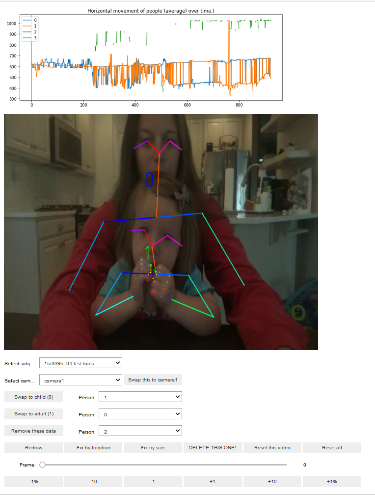

# Drumming tutorial
## A demo of how to extract rhythmic movement data from videos. 
## March 2022

This page and contents of this folder helps you walk through using the VASC toolkit with a small subset of the dataset from our [Little Drummers](https://github.com/InfantLab/little-drummers) experiment. It uses the VASC toolkit scripts in the folder above to extract rate of drumming from a videos of infants banging on a table. For comparison, two videos of adults performing the same tasks are also included. More details of the experiment can be found in *Assessing sensorimotor synchronisation in toddlers using the LookIt online experiment platform and automated movement extraction* (Rocha and Addyman, 2022) [link to follow]

This folder contains

 * `Little Drummers Supplmentary Materials.docx` - A more detailed narrative account of the 
 * `LD.settings.json` - a structured file telling the scripts where to find videos and save outputs.
 * `LittleDrummers_TutorialManualCoding.xlsx` - A spreadsheet of supporting information and manual coding of drumming videos. (Used by Step 3) 
 * `videos` - a folder of 6 videos per participant (3 child, 2 adult, used with permission). 
 * `timeseries` - a folder where we store data arrays containing the generated movement data.


## Step 0 - Installation

In order to run the tutorial, download or clone a copy of the VASC project from GitHub to your local machine. You also need a copy of Python, a copy of OpenPose and some supporting software. Follow the install instructions on the [main page](https://github.com/InfantLab/VASC#installation) to install these prerequisites. 

If you are unfamiliar with Jupyter Notebooks, there are [plenty](https://www.youtube.com/watch?v=3C9E2yPBw7s) of [introductory videos](https://www.youtube.com/watch?v=DKiI6NfSIe8) on [YouTube](https://www.youtube.com/results?search_query=learning+jupyter). You could also check out my [Notebooks Tutorial](https://github.com/InfantLab/NotebookDemos)/ 


## Step 1 - Processing the videos

Open your local copy of the file [Step1.ProcessVideo.ipynb](https://github.com/InfantLab/VASC/blob/master/Step1.ProcessVideo.ipynb) from an instance of Jupyter or JupyterLab running on your local system.

That document should then guide you through the process of getting OpenPose to convert each video into a set of frame by frame pose estimates. Here we will show the outputs you should expect and some of the problems to watch out for. 

### Step 1.1-3 Settings

To keep track of information that is used across multiple steps we load and save data to a number of text files in the JSON and other formats. The first one of these is `Drum.Tutorial.settings.json`. It contains a set of file names that we will save and where they are located. It also includes several settings flags that 

For your own projects you can create a copy of this file and modify it to point to your own files. 

#### Where is OpenPose

One important line in the settings file tells us where the OpenPose application is located. **You will need to edit this to match the location of this file on you computer. Note that the path needs double backslashes or it will give an error.**

'openpose': 'C:\\Users\\cas\\openpose-1.5.0-binaries-win64-gpu-python-flir-3d_recommended\\'

#### Three useful flags

```
"flags": {
    "anon": false,
    "includeHands": true,
    "cleaned": true
  },
```
The flags section of settings file tells the code several useful things. 
* `anon` - whether or not to display images from video in Step 2. (Normally this is set to false, setting it true lets you process files anonymously. 
* `includeHands` - tells OpenPose and VASC whether to keep track of location of hands. Improves accuracy but increases memory requirements. Set to true for this tutorial. 
* `cleaned` - tells us whether Step 2 data cleaning has been completed. 

### Step 1.4 Loading the videos

In this step we create another JSON file called `videos.json` which keeps track of information about the videos we are processing. The code looks to see if this file exists and if not creates a new version. Then it searchs the `videos` folder and adds all videos found, so they can be processed. 

### Step 1.5 - Processing with OpenPose

This is the main step which of part 1. We loop through all the videos and for each one we pass it to the OpenPose app (OpenPoseDemo.exe / OpenPose.bin). Essentially, we are recreating in code what you would do on a command line for each individual video. So we need to know the location of the video, the location we want to output the data and what flags to use. See the [OpenPose documentation](https://github.com/CMU-Perceptual-Computing-Lab/openpose/blob/master/doc/01_demo.md) for more details. 

### Step 1.6-7- Organising Data

For each video OpenPose will output a separate JSON file for each individual frame containing all the coordinates of all the people it has found in that frame. This data needs to be combined into a single data-structure so that it is more useful. That is the goal of these steps. 

We use the standard NumPy array for this. But because these arrays can get large we save in a compressed format. The names and locations of the saved files are found in our settings.json file. 


<!-- #region -->
## Step 2 - Cleaning the data

Step 2 is the most time consuming step as it involves manually checking how OpenPose has labelled teh people in the video. And relablelling them where necessary. We provide some visual inspection tools and some automated algorithms to speed up this process. 

Open your copy of [Step2.OrganiseData.ipynb](https://github.com/InfantLab/VASC/blob/master/Step2.OrganiseData.ipynb) in Jupyter.

### Steps 2.0-1

As with Step 1 we first need to load any libraries that Python uses and then open the settings.json and videos.json from Step 1. 

### Step 2.2 Load data from Step 1

Here we reload into memory the data we saved in Step 1. 

### Step 2.4 Cleaning data using the Control Panel

This is the main interface to select individual videos and see if any relabelling is required. Here we explain it's features.



In the control panel the first panel is a plot of the mean horizontal location of each participant in each frame of the video. This gives you an overview of their movement, how they have been labelled by Openpose and how many people OpenPose thinks are in the video. There is vertical line to identify the current frame (chosen by the slider). In the current example this looks messy because OpenPose has been inconsistent in labelling people. 

Below, you see the current frame overlaid with the OpenPose estimates of participant locations (including hand and finger location if includeHands = True). Each participant has a number corresponding to the label given to them by OpenPose. We will see below that these can often be highly inconsisten from frame to frame. 
Below the frame image we have several drop-downs and buttons that let us interact with the code. There is also a slider that lets us select a different frame from the video. And finally a set of buttons that let us jump +/-1%, +/-10 frames or +/-1 frame. 

#### Manual cleaning steps: 
1. Use the first drop down to pick which video to process. 
2. Sometimes we have multiple cameras, Select camera with best view of both participants - swap this to camera 1 (if multiple cameras).
3. You might delete sets for whom all data is too poor quality. But they can also be excluded in **Step 3** by a flag in the data spreadsheet.
4. Tag the infant and adult in first frame of interest. So both individuals should be in first frame. In the current example The adult has been labelled 1, while the child is 0. We always want child to be 0. So we use the `Swap to child(0)` button swap the data. 

*Note that this swap applies to the current frame* **and all subsequent frames**.  

5. Try to automatically tag then in subsequent frames. (See below)
6. Manually fix anything the automatic process gets wrong.
7. Remove other detected people (3rd parties & false positives)

### Step 2.4. - Fix by location example

To get around the quirks of OpenPose we to fix the labels. In the next image you see that for video `bb22644a_08-test-trials` the algorithm was highly inconsistent with it's labelling of the participants.  (OpenPose doesn't compare one frame with another so it treats each on independently).


Example of using the `Fix by Location` button. The algorithm starts assuming that individuals are correctly labelled in the first frame and then for each subsequent frame it assumes that the person nearest that location is also the same individual.  In many cases `Fix by Location` will correct the assignments. But if the data is noisy, some manual intervention will also be required.


### Steps 2.5-8 Saving the data

Once the data is cleaned we save in a multi-index dataframe to make analysis steps easier.
<!-- #endregion -->

<!-- #region -->
## Step 3 - Extracting Movement

Open your copy of [Step3.ExtractMovement.ipynb](https://github.com/InfantLab/VASC/blob/master/Step3.ExtractMovement.ipynb) in Jupyter.

### Steps 3.0-3.1 - Load data from Step 2.

As before we first load the required Python libraries and the data processed in the previous Step.

### Step  3.2.1 - Interpolate missing data. 

We use numpy's built in `replace()` and `interpolate()` functions to linearly interpolate any gaps in the time series of each individual body and hand marker. 

### Step 3.2.2 - Mean body part movements

In some cases we might wish to know the avearge location of the head, body, arm or hand. To do this we average together all the points for a given body part and create a new time series for this point. Likewise we may with smooth the movement data by taking a moving average of several frames at once. Or look at the amount of movement by calculating a variance measure. 

One slightly unusual calculation is our measure of mean Hand location. For this we give greater weight to the single wrist marker compared to the 21 points from the hand markers. 


### Step 3.3 - Visualising the data.

We provide another simple control panel to let users visually examine new calculated time series. Using the drop down menus, users can select a given video and look at time series of movements of individual body parts. For the Little Drummers study we were interested in vertical (y-axes) displacement of the hands. 

 

### Step 3.4 - Looking at data trial by trial

For the Little Drummers study we manually coded each video to indicate if the infants were visible in the video and if they were drumming and which (left, right, both) hands they were using. We also needed to know what type of trial it was and what target frequency infant may have seen. This information was entered in a spreadsheet. Here we load up that info so we can use it to process the data further.

### Step 3.5 Finding fundamental frequency

Once we know if an infant was drumming and which hand they used, we can use Fourier Transforms to find the main frequency of their drumming. For each child we plot the vertical (y-axis) displacement of the (averaged) hand location and then transform the time-series into a frequency plot. We filter slow movements (less than 1 Hertz) and plot the distribution of other frequencies. We use numpy's `argmax()` function to locate the maximum (fundamental) frequency. 


*Plots for infant 1fa3339b Trial 3. The target interstimulus interval as 500ms, (2Hz). The left most plot shows the vertical displacement of the left hand, the next plot shows the corresponding frequency plot. The other two plots show same info for right hand. The infant was drummming with frequency of 2.27 Hz, an ISI of 440ms.


<!-- #endregion -->

### Bugs and Feedback

If you have any comments or questions, either contact [Caspar Addyman <c.addyman@gold.ac.uk](mailto:c.addyman@gold.ac.uk) or submit an [issue report](https://github.com/InfantLab/VASC/issues).
